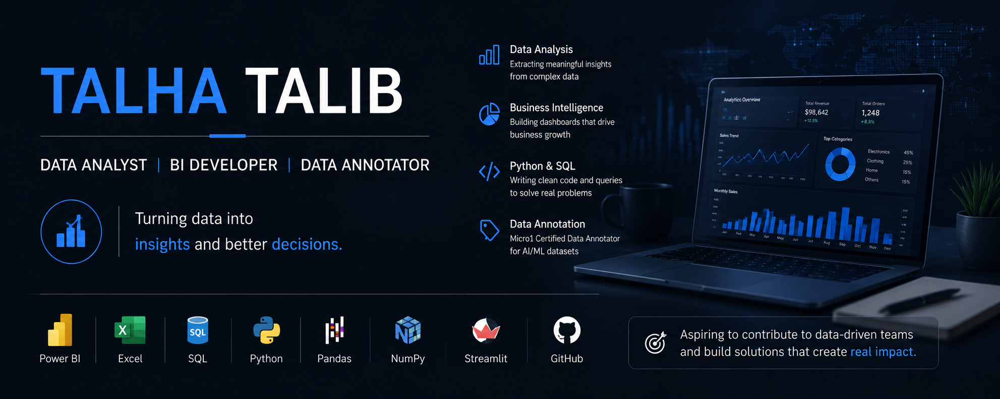

# 👋 Hi, I'm Talha Talib

### Data Analyst | BI Developer | Data Annotation Specialist | Aspiring ML Practitioner

> I work with data to clean, analyze, visualize, and extract insights using Power BI, SQL, and Python. I also have experience in data annotation for AI/ML datasets.

---

## 🚀 About Me

- 🎯 Data Analyst focused on BI and reporting
- 🧠 Experience in data annotation (Micro1 Certified)
- 📊 Strong in Power BI dashboards and Excel analytics
- 🐍 Learning Python for data analysis and machine learning
- 🌍 Open to Data Analyst / BI / Data Annotation roles (Remote & International)

---

## 🛠 Skills

### 📊 Data Analytics & BI
Power BI · DAX (Intermediate) · Power Query · Data Modeling · KPI Dashboards · Excel (Advanced)

### 💻 Programming
Python (Basic–Intermediate) · SQL (Joins, Aggregations, Window Functions)

### 📚 Python (Data Focused)
Pandas (Basic–Intermediate) · NumPy (Basic) · Matplotlib (Basic) · Seaborn (Basic)

### 🤖 Machine Learning (Learning Phase)
Regression · Classification · Clustering · Basic Model Evaluation

### 🧹 Data Annotation & Labeling
Image/Text Data Annotation · Labeling for AI/ML datasets · Data Quality Checks  
(Micro1 Certified Data Annotator)

---

## 💼 Projects

### 📊 Power BI Dashboards
- Sales & Revenue Analysis Dashboard
- KPI Tracking Dashboards for Business Insights
- Customer & Product Performance Reports
- Time-based trend analysis (MoM / YoY)

---

### 🐍 Python Data Analysis Projects
- Exploratory Data Analysis (EDA) on real datasets
- Data cleaning and preprocessing tasks
- Basic visualization dashboards using Matplotlib/Seaborn

---

### 🤖 ML Internship Projects (Beginner Level)
- Built and evaluated basic classification models
- Worked on datasets like churn prediction, loan approval, insurance prediction
- Applied Logistic Regression, Decision Trees, Random Forest (guided projects)

---

### 🧠 AI Data Analysis App (Streamlit)
- Simple web app for uploading CSV/Excel files
- Basic automated EDA and visualization
- Beginner-level forecasting experiments

---

## 🎓 Education

**BS Data Science**  
University of the Punjab (PUCIT), Lahore  
2024 – 2028 (In Progress)

---

## 📜 Certifications

- Micro1 Certified Data Annotator  
- Oracle Database Fundamentals  
- Advanced SQL – HackerRank  
- Data Analysis with Python – DG Skills  
- Data Visualization – TATA (Forage)  
- Cisco Networking Basics  
- Basic Cloud Computing – Great Learning  

---

## 📫 Contact

- 📧 Email: talhatalib.analyst@gmail.com  
- 🔗 LinkedIn: linkedin.com/in/talha-talib-97bb89384  
- 💻 GitHub: github.com/Ch4847  

---

## ⚡ Career Goal

To grow as a Data Analyst / BI Developer while improving my skills in Python, SQL, Power BI, and gradually advancing into Machine Learning and AI-driven analytics.
